# Leo Tolstoy's Fountain Pen: The Swan by Mabie, Todd & Co.

> A granular reference document compiled from primary sources including the Yasnaya Polyana Museum
> (ypmuseum.ru), collector archives, and period accounts.

---

## Table of Contents

1. [Overview](#overview)
2. [The Manufacturer: Mabie, Todd & Co.](#the-manufacturer-mabie-todd--co)
3. [The Specific Pen: Swan Eyedropper Series](#the-specific-pen-swan-eyedropper-series)
4. [Period Models Most Consistent with Tolstoy's Pen](#period-models-most-consistent-with-tolstoys-pen)
5. [Filling System & Ink Filler Device](#filling-system--ink-filler-device)
6. [The Ink](#the-ink)
7. [Provenance: The Chertkov Connection](#provenance-the-chertkov-connection)
8. [Chronology of Tolstoy's Pens](#chronology-of-tolstoys-pens)
9. [Physical Description of Tolstoy's Pen](#physical-description-of-tolstoys-pen)
10. [Associated Accessories at Yasnaya Polyana](#associated-accessories-at-yasnaya-polyana)
11. [Before the Swan: Earlier Writing Instruments](#before-the-swan-earlier-writing-instruments)
12. [Writing Posture and Habits](#writing-posture-and-habits)
13. [Image Gallery](#image-gallery)
14. [Sources](#sources)

---

## Overview

Leo Tolstoy was **one of the first Russian writers to adopt an English self-filling fountain pen**. All
confirmed fountain pens in his possession were **Swan pens manufactured by Mabie, Todd & Co.**, gifted
to him by his closest follower and literary executor, Vladimir Grigoryevich Chertkov, who lived in
English exile from the mid-1890s onward. Tolstoy's Swan pen accompanied him to the end of his life:
his last diary entries (3 November 1910) were written with it, and he died holding the pen from his
final letter on 20 November 1910.

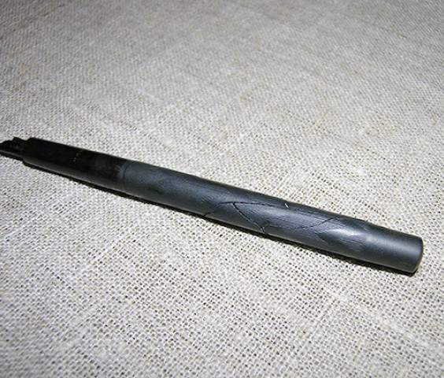
*Tolstoy's writing implements as preserved at the Yasnaya Polyana Museum. Source: ypmuseum.ru*

---

## The Manufacturer: Mabie, Todd & Co.

| Detail | Value |
|--------|-------|
| **Full early name** | Mabie, Todd & Bard of New York, USA |
| **Founded** | 1873 |
| **Renamed** | Mabie, Todd & Co. (after 1907, when Bard left) |
| **New York incorporation** | ~1907 |
| **London branch opened** | 1884 |
| **UK production begins** | 1905 (under licence) |
| **Swan line introduced** | 1890 (trademark filing confirms "in use since 1890") |
| **Trademark** | White swan on waves |
| **Popular nickname** | "Pens of the British Empire" |
| **Pen hierarchy** | Swan (top) > Blackbird > Swallow > Cygnet (stylographic) |

*Mabie, Todd & Co. Swan trademark. Source: penhero.com*

**Tolstoy's pens were manufactured in New York but sold via the English London branch.** The original
packaging box preserved in his study at Yasnaya Polyana (dated to 1905) confirms this: it bears New
York production markings and was purchased through the English Mabie, Todd & Co. branch.

---

## The Specific Pen: Swan Eyedropper Series

Tolstoy's pens were **Swan eyedropper-fillers (ED)**. These were Mabie Todd's flagship writing
instruments from 1890 through approximately 1916, when lever-fill mechanisms began to replace them.

### Construction

| Component | Detail |
|-----------|--------|
| **Barrel material** | Black hard rubber (vulcanite/ebonite) |
| **Finish** | "Chased" — heat-imprinted decorative pattern rolled onto the barrel |
| **Type name** | BCHR — Black Chased Hard Rubber |
| **Cap style** | Straight cap, slip-on or screw-on depending on model |
| **Clip** | Gold pocket-clip for attaching to shirt/blouse (confirmed present on Tolstoy's pen) |
| **Nib** | Gold nib (14k) with "over-under" or "double" feed design |
| **Nib flexibility** | Semiflex to flexible — Swan nibs of this era were known for responsiveness |
| **Nib sizes available** | Extra fine, fine, medium fine, medium, broad, extra broad, oblique |
| **Filling system** | Eyedropper (no internal mechanism) |
| **Length (typical)** | 13–14.5 cm capped |

The **BCHR finish** is the defining characteristic: the barrel and cap are black vulcanised rubber
with a repeating chased (embossed) pattern — typically a fine crosshatch, barleycorn, or geometric
design. Over time and with sun exposure, BCHR oxidises to an "olive" tone (browning-greening), but
specimens kept away from light retain their deep black colour.

---

## Period Models Most Consistent with Tolstoy's Pen

The following models from the vintagepens.com illustrated catalogue represent the Swan eyedroppers
closest to the period 1893–1910 when Tolstoy received and used his pens.

### Model: Swan Eyedropper — Hard Rubber with Silver Overlay (c. 1895)

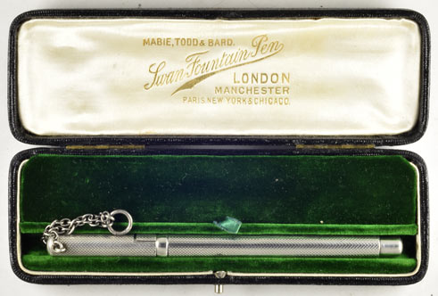
*Swan eyedropper-filler, hard rubber with silver overlay, 13.25 cm, extra broad nib, c. 1895.
Source: vintagepens.com, ID 17122*

| Attribute | Value |
|-----------|-------|
| **Catalogue ID** | 17122 |
| **Date** | c. 1895 |
| **Material** | Hard rubber with silver overlay |
| **Length** | 13.25 cm |
| **Nib** | Extra broad |
| **Filling** | Eyedropper |
| **Relevance** | Period-correct for Tolstoy's first Swan pen (1893 gift from Chertkov) |

---

### Model: Swan Eyedropper — Gold-Filled Barleycorn Overlay (c. 1902)

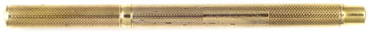
*Swan eyedropper-filler, gold-filled barleycorn overlay, 13.6 cm, broad semiflex nib, c. 1902.
Source: vintagepens.com, ID 16300*

| Attribute | Value |
|-----------|-------|
| **Catalogue ID** | 16300 |
| **Date** | c. 1902 |
| **Material** | Gold-filled barleycorn overlay |
| **Length** | 13.6 cm |
| **Nib** | Broad, semiflex |
| **Filling** | Eyedropper |
| **Relevance** | Mid-period; typical of pens Chertkov would have sent as replacements ~1905 |

---

### Model: Swan Eyedropper — Fleur-de-lys Gold Overlay (c. 1905)

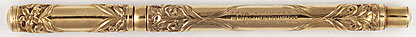
*Swan eyedropper-filler, rare Fleur-de-lys gold overlay, 13.5 cm, medium stub nib, c. 1905.
Source: vintagepens.com, ID 11132*

| Attribute | Value |
|-----------|-------|
| **Catalogue ID** | 11132 |
| **Date** | c. 1905 |
| **Material** | Rare Fleur-de-lys gold overlay on hard rubber |
| **Length** | 13.5 cm |
| **Nib** | Medium stub |
| **Filling** | Eyedropper |
| **Relevance** | Period-exact for the box preserved at Yasnaya Polyana (1905) |

---

### Model: Swan 200 BCHR Eyedropper (pre-1920) — Closest Match to Tolstoy's Black Pen

This is the most probable type of pen Tolstoy actually carried. The descriptions from Yasnaya Polyana
confirm a **black pen**; all decorative overlay variants were also available, but the plain BCHR
(Black Chased Hard Rubber) model was the standard production pen sold through the English branch.

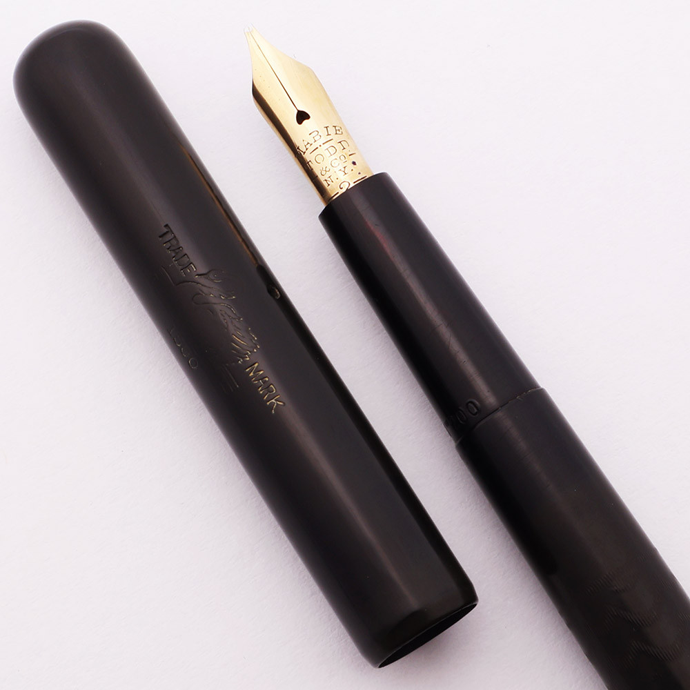
*Swan Model 200 BCHR eyedropper-filler, pre-1920. Black chased hard rubber, oblique flexible nib.
Source: peytonstreetpens.com*

| Attribute | Value |
|-----------|-------|
| **Model** | Swan 200 (also rendered as Swan 2 or Swan No. 200) |
| **Date** | Pre-1920 (production range 1890s–1916) |
| **Material** | BCHR — Black Chased Hard Rubber |
| **Nib** | Oblique, flexible |
| **Cap** | Straight cap with gold band |
| **Filling** | Eyedropper — section unscrews, barrel filled by dropper |
| **Relevance** | **Primary candidate for Tolstoy's pen**: black, chased, gold clip, eyedropper |

---

### Model: Swan 1500 BCHR Eyedropper (Antique, Period-Correct)

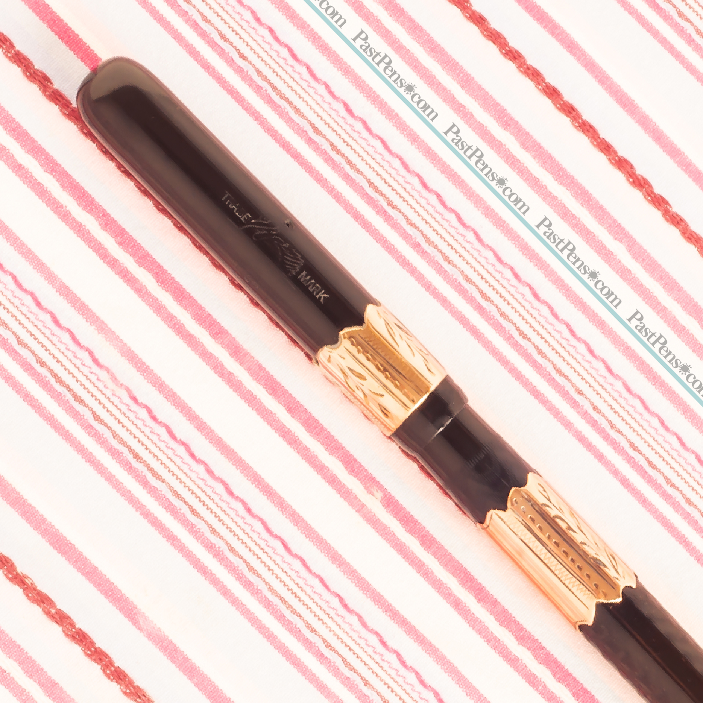
*Antique Mabie Todd Swan 1500 BCHR eyedropper-filler. Source: pastpens.com*

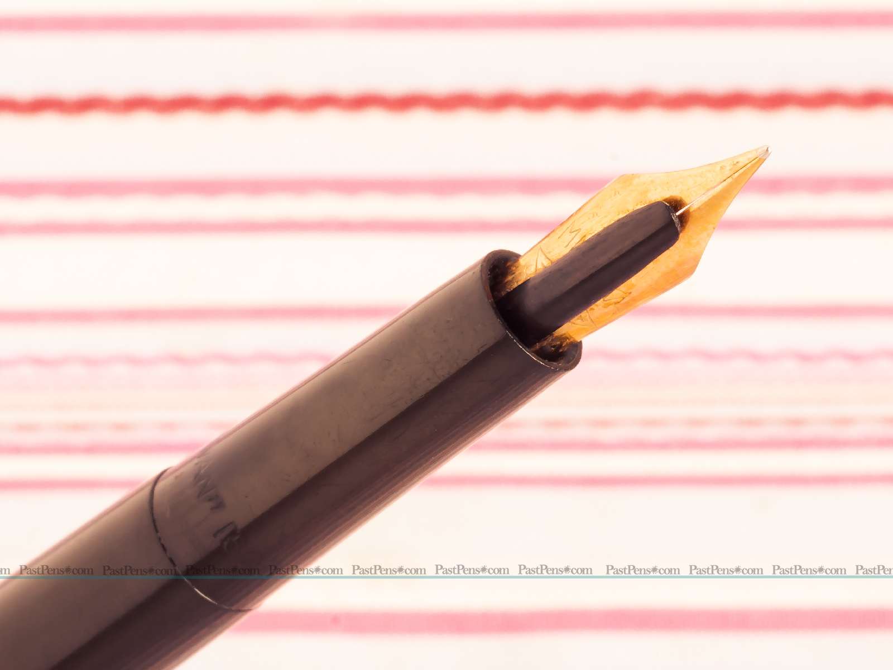
*Swan 1500 BCHR — gold nib detail. Note the "over-under" double feed. Source: pastpens.com*

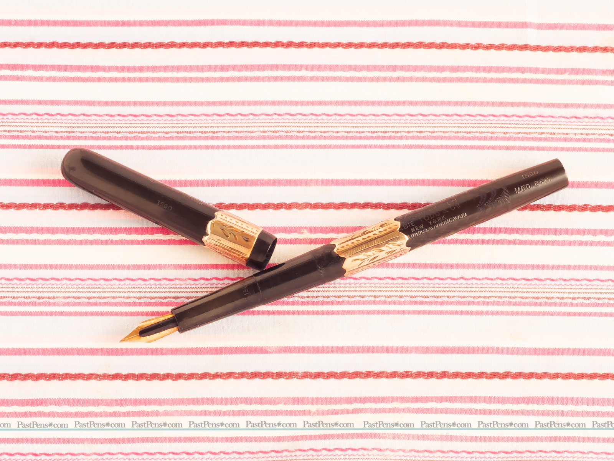
*Swan 1500 — "SWAN" imprint on barrel. Source: pastpens.com*

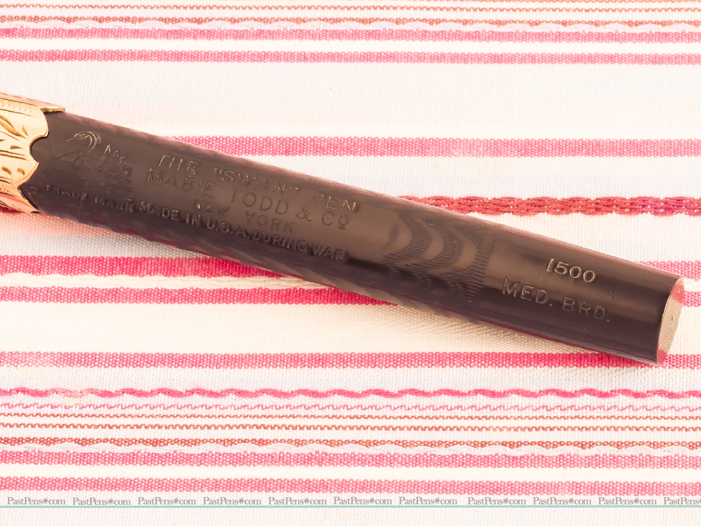
*Swan 1500 BCHR — barrel imprint showing "Mabie Todd & Co." Source: pastpens.com*

| Attribute | Value |
|-----------|-------|
| **Model** | Swan 1500 |
| **Material** | BCHR — Black Chased Hard Rubber |
| **Nib** | Gold, flexible |
| **Feed** | Over-under double feed (early ink flow design) |
| **Filling** | Eyedropper |
| **Barrel imprint** | "SWAN / MABIE TODD & CO." |

---

### Gold-Filled Hand-Engraved Overlay Swan (c. 1914)

Photographs showing the finest detail of Swan eyedropper construction from the same era:

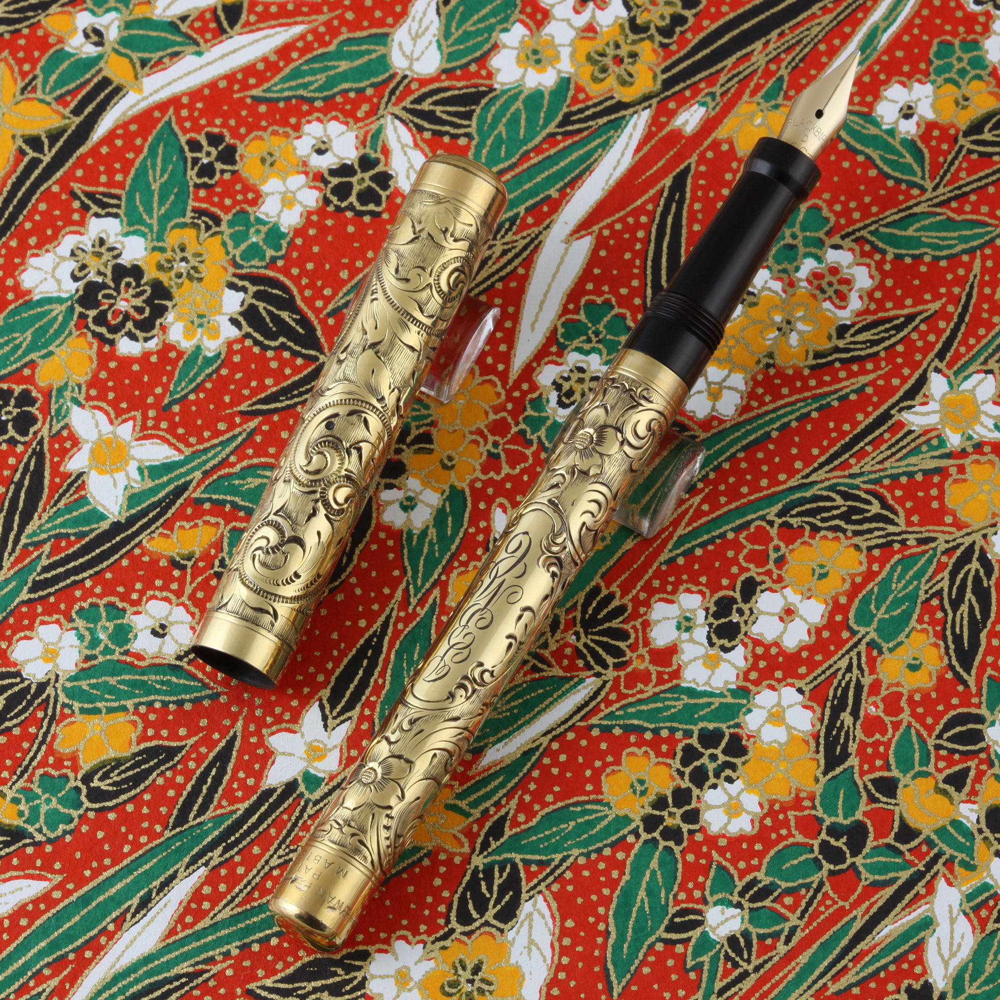
*Mabie Todd Swan gold-filled hand-engraved overlay eyedropper, c. 1914 — full pen view. Source: penhero.com*

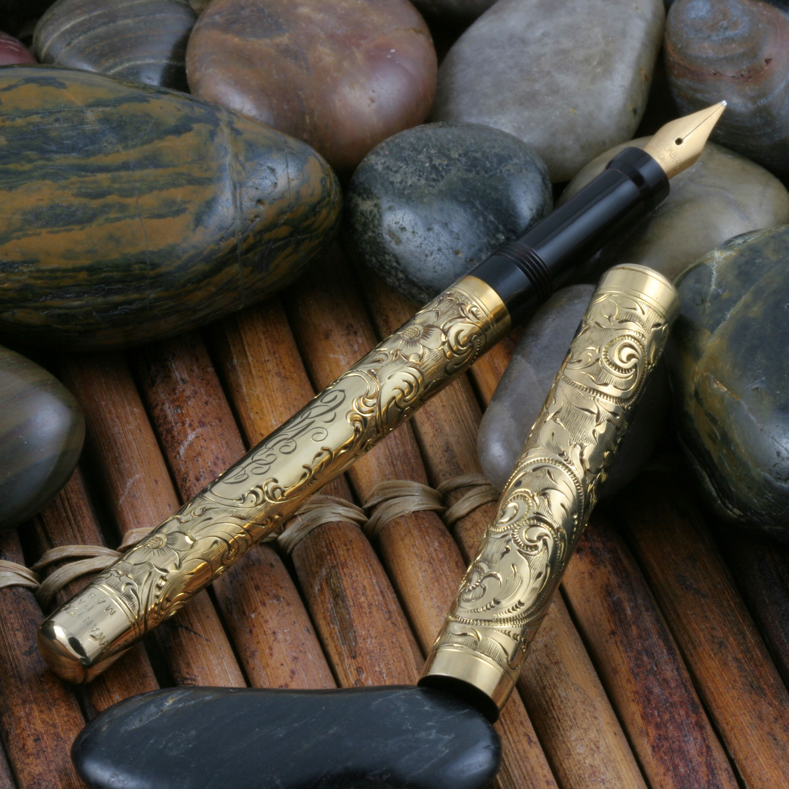
*Mabie Todd Swan gold-filled eyedropper, c. 1914 — barrel detail. Source: penhero.com*

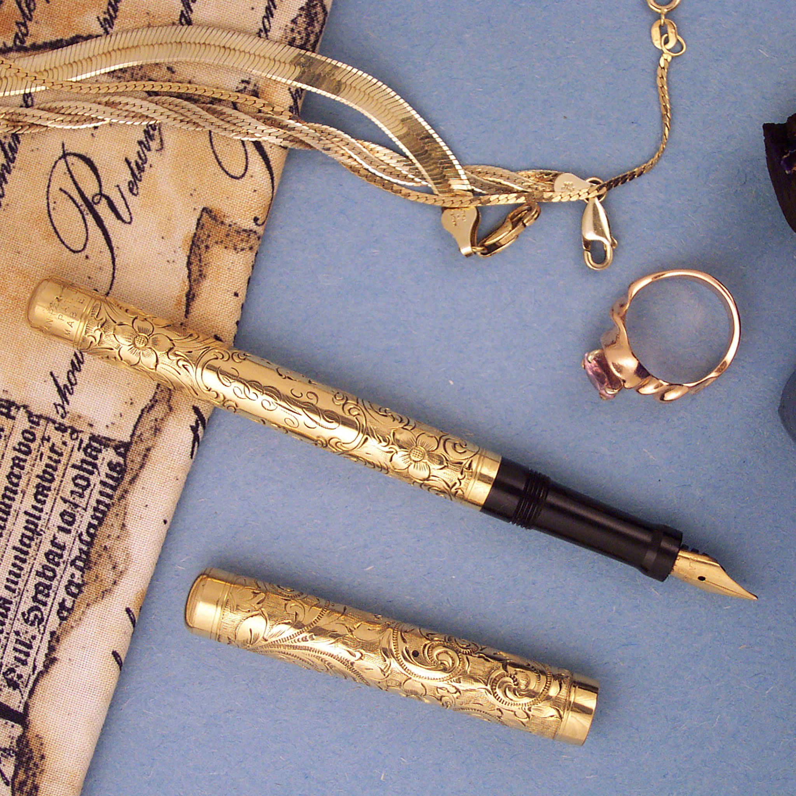
*Mabie Todd Swan gold-filled eyedropper, c. 1914 — nib and section. Source: penhero.com*

---

### Period Advertisement

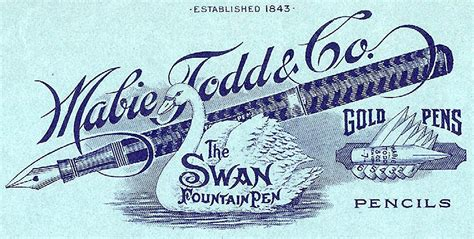
*Period Mabie, Todd & Co. Swan advertisement — gold floral-etched hard rubber pen. Source: pastpens.com*

A Swan fountain pen advertisement also appears in the journal *Review of Reviews* preserved in
Tolstoy's memorial library at Yasnaya Polyana, confirming his awareness of the brand.

---

## Filling System & Ink Filler Device

Swan pens of the 1890–1910 era used an **eyedropper (ED) filling system** — the only system Mabie,
Todd & Bard produced. There was no internal filling mechanism.

### How It Worked

1. **Unscrew the section** (nib + grip unit) from the barrel
2. **Fill the hollow barrel** with ink using an eyedropper or a dedicated filler device
3. **Re-attach the section**; surface tension and air pressure retain the ink
4. **Write** — ink feeds to the nib via the "over-under" double feed

### Tolstoy's Filler Device

The Yasnaya Polyana museum collection includes a **special ink-charging device** (*штучка для
заряжания чернил* in Tolstoy's own words):

| Component | Description |
|-----------|-------------|
| **Glass flask** | Small reservoir holding the ink supply |
| **Rubber balloon** | Squeezable bulb that creates suction to draw ink into the pen barrel |
| **Function** | Press balloon, insert flask tip into barrel, release balloon to draw ink in |

This device is documented in Tolstoy's **last letter to his daughter Aleksandra, dated 28 October
1910**, written from the Optina Pustyn monastery after he left Yasnaya Polyana for the final time:

> *"Please bring me the little device for charging ink that I left at home."*
> — L.N. Tolstoy to Alexandra Tolstaya, 28 October 1910

The pen and ink were among the items he took with him when he departed Yasnaya Polyana — but the
filler device was accidentally left behind.

---

## The Ink

### Brand: Swan Ink (Mabie, Todd & Co.)

Tolstoy used **Swan-branded ink** sold by Mabie, Todd & Co. The Yasnaya Polyana museum preserves:
- **Ink bottles with Swan-branded labels** in Tolstoy's study
- The bottles bear the Mabie, Todd & Co. swan trademark

### Ink Characteristics (period Swan ink, 1890s–1910s)

| Property | Detail |
|----------|--------|
| **Type** | Iron-gall based (standard for the era) |
| **Colour** | Blue-black (typical period writing ink; darkens to near-black on drying) |
| **Permanence** | Iron-gall ink oxidises on the page over time — highly archival; consistent with the preserved Tolstoy manuscripts showing dark, legible text |
| **Viscosity** | Thin/watery — required for eyedropper pens with capillary feeds |
| **Bottle label** | Swan motif (white swan on waves), matching the pen trademark |

Iron-gall ink was the standard literary ink of the era. Tolstoy's manuscripts, preserved in the
Russian State Library and at Yasnaya Polyana, show characteristically dark, fine-line script consistent
with a flexible gold nib and iron-gall ink.

---

## Provenance: The Chertkov Connection

All of Tolstoy's fountain pens came from a single source:

**Vladimir Grigoryevich Chertkov (1854–1936)**
- Tolstoy's closest disciple, literary executor, and publishing collaborator
- Exiled from Russia by Tsar Alexander III for his Tolstoyan activism; lived in England ~1897–1908
- During his English exile, Chertkov had direct access to London's stationery trade
- Purchased Swan pens from the Mabie, Todd & Co. London branch (opened 1884, at 79–83 Cheapside)
- Gifted Tolstoy his first Swan pen in **1893**
- Gifted a second Swan pen (with a "wonderful notebook") in **1897**
- Sent **three replacement pens** ~1905 after Tolstoy lost the original
- Chertkov systematically archived all Tolstoy's manuscripts from the late 1880s onward, storing
  them in a specially built steel vault at his house in Christchurch, Hampshire, England

---

## Chronology of Tolstoy's Pens

| Date | Event | Pen |
|------|-------|-----|
| **1889** | Tolstoy writes: *"I have a steel pen in my hand"* (working on *On Science and Art*) | Steel dip pen (pre-fountain pen era for Tolstoy) |
| **1893** | Chertkov gifts first Swan fountain pen; Tolstoy writes: *"See how well your pen writes"* | Swan eyedropper, type unspecified |
| **1897** | Chertkov gifts second Swan pen ("Swanpen" model) with "a wonderful notebook" | Swan "Swanpen" model eyedropper |
| **~1905** | Tolstoy loses his pen; greatly distressed. Original 1905 packaging box preserved in study | Swan BCHR eyedropper (New York-made, sold via London branch) |
| **~1905** | Chertkov sends **three replacement Swan pens** | 3× Swan BCHR eyedroppers |
| **1907** | A black "Universal" Swan pen left in Sofia Andreyevna's room (possibly gifted by Tolstoy) | Swan "Universal" model |
| **22 July 1910** | Secret final testament signed in Yasnaya Polyana forest with a Swan pen | One of the three replacement pens |
| **28 October 1910** | Tolstoy departs Yasnaya Polyana for the last time, taking pen and ink; writes to Aleksandra for the filler device | Swan pen |
| **3 November 1910** | Last diary entries written bedridden with Swan pen | Swan pen |
| **20 November 1910** | Tolstoy dies at Astapovo railway station | — |

---

## Physical Description of Tolstoy's Pen

From museum records and period accounts:

| Feature | Description |
|---------|-------------|
| **Colour** | Black |
| **Material** | Ebonite (hard rubber) — described as "black reservoir pen" |
| **Clip** | Gold pocket-clip; worn clipped to Tolstoy's shirt/blouse (his characteristic writing blouse) |
| **Attachment method** | Clip-holder mechanism on blouse breast pocket |
| **Position when worn** | Attached to the middle of the shirt with the clip-holder |
| **Inherited pen in desk** | A separate black reservoir pen was kept in the **middle drawer** of Tolstoy's desk — inherited from his father, Nikolai Ilyich Tolstoy |
| **Note** | The desk pen (inherited) and the Swan pen (from Chertkov) are distinct objects; the Swan is the fountain pen used for manuscripts and the testament |

---

## Associated Accessories at Yasnaya Polyana

All items preserved and exhibited at the Yasnaya Polyana Museum:

| Item | Description |
|------|-------------|
| **1905 pen box** | Original Mabie, Todd & Co. packaging box; New York production; confirms English purchase |
| **Swan clip-holder** | Separate accessory with relief swan emblem; kept on the round table in Tolstoy's study |
| **Swan ink bottles** | Multiple; bear the Swan (Mabie, Todd & Co.) white swan trademark label |
| **Ink filler device** | Glass flask + rubber balloon; for refilling the eyedropper barrel |
| **Black "Universal" pen** | Second Swan pen in Sofia Andreyevna's room; likely gifted by Tolstoy 1907 |
| **Swan advertisement** | Preserved in *Review of Reviews* journal in Tolstoy's memorial library |

---

## Before the Swan: Earlier Writing Instruments

### Goose Quill / Feather Pens (pre-1850s)
Standard Russian writing instrument of Tolstoy's early years. No specific specimens confirmed in
the museum collection.

### Steel-Nibbed Dip Pens (1850s–1893)
The primary instrument for Tolstoy's greatest works:
- *War and Peace* (drafted 1863–1869) — **7 complete recopying cycles** before final form
- *Anna Karenina* (drafted 1873–1877)
- Sofia Andreyevna recopied all manuscripts by candlelight from Tolstoy's cramped originals

In 1889, Tolstoy explicitly described himself writing with "a steel pen" (*стальное перо*) — a dip
pen requiring a separate inkwell, distinct from the self-filling Swan he would later adopt.

---

## Writing Posture and Habits

Tolstoy's physical writing practice shaped how he used his instruments:

| Habit | Detail |
|-------|--------|
| **Nearsightedness** | Severe; he wrote hunched close to the page |
| **Chair modification** | Legs of his writing chair **sawn shorter** to allow deeper hunching over the desk |
| **Handwriting** | Small and cramped; dense packing of text on each page |
| **Revision practice** | Obsessive — he wrote that he could not understand how anyone could write "without rewriting everything over and over again" |
| **Manuscript storage** | Kept inside desk drawers; desk moved between rooms as he relocated his study |
| **Paper** | Mixed quality — expensive sheets gifted by Chertkov alongside cheap scrap paper; kept in an envelope labelled *"клочки"* (scraps) |
| **Carrying the pen** | Clipped to his blouse pocket; the pen was a constant companion in later life |

---

## Image Gallery

| # | Filename | Description | Era |
|---|----------|-------------|-----|
| 01 | `01_yasnaya_polyana_museum_tolstoy_writing_implements.jpg` | Tolstoy's actual writing implements, Yasnaya Polyana Museum | — |
| 02 | `02_swan_eyedropper_silver_overlay_c1895.jpg` | Swan eyedropper, hard rubber + silver overlay, 13.25 cm | c. 1895 |
| 03 | `03_swan_eyedropper_gold_barleycorn_c1902.jpg` | Swan eyedropper, gold barleycorn overlay, 13.6 cm | c. 1902 |
| 04 | `04_swan_eyedropper_fleurdelys_gold_c1905.jpg` | Swan eyedropper, Fleur-de-lys gold overlay, 13.5 cm | c. 1905 |
| 05 | `05_swan_eyedropper_silver_generic.jpg` | Swan eyedropper in silver — generic period example | c. 1895–1905 |
| 06 | `06_swan_chatelaine_eyedropper.jpg` | Swan early silver chatelaine eyedropper | c. 1890s |
| 07 | `07_mabie_todd_swan_gold_filled_eyedropper_c1914_a.jpg` | Swan gold-filled hand-engraved eyedropper — full pen | c. 1914 |
| 08 | `08_mabie_todd_swan_gold_filled_eyedropper_c1914_b.jpg` | Swan gold-filled eyedropper — barrel detail | c. 1914 |
| 09 | `09_mabie_todd_swan_gold_filled_eyedropper_c1914_c.jpg` | Swan gold-filled eyedropper — nib and section | c. 1914 |
| 10 | `10_mabie_todd_swan_company_logo.jpg` | Mabie, Todd & Co. Swan company trademark logo | — |
| 11 | `11_swan200_BCHR_eyedropper_pre1920_main.jpg` | Swan 200 BCHR eyedropper — **closest match to Tolstoy's black pen** | Pre-1920 |
| 12 | `12_swan1500_BCHR_eyedropper_antique_main.jpg` | Swan 1500 BCHR eyedropper — full pen, antique | Period |
| 13 | `13_swan1500_BCHR_eyedropper_gold_nib.jpg` | Swan 1500 BCHR — gold nib close-up | Period |
| 14 | `14_swan1500_BCHR_eyedropper_model_stamp.jpg` | Swan 1500 BCHR — "SWAN" barrel stamp | Period |
| 15 | `15_swan1500_BCHR_barrel_imprint.jpg` | Swan 1500 BCHR — "Mabie Todd & Co." barrel imprint | Period |
| 16 | `16_mabie_todd_swan_period_advertisement.jpg` | Period Mabie Todd Swan advertisement | c. 1896–1905 |

---

## Sources

### Primary Sources
- [Yasnaya Polyana Museum — Письменные принадлежности Льва Толстого (Tolstoy's Writing Implements)](https://ypmuseum.ru/event/446)
- [Yasnaya Polyana Museum — Stationery of L.N. Tolstoy (English)](http://ypmuseum.ru/en/component/igallery/izbrannye-exponaty-memorialnoy-kollekcii/stationerytolstoy.html)

### Pen Collector & Historical Sources
- [Год Литературы — 115 лет патенту Джорджа Паркера (on Tolstoy's fountain pen)](https://godliteratury.ru/articles/2020/05/06/115-let-nazad-dzhordzh-parker-zapatentoval)
- [David Nishimura — Vintage Pens: Mabie Todd Swan](https://vintagepens.com/Mabie_Todd_Swan.shtml)
- [David Nishimura — Illustrated Catalogue: Mabie Todd](https://www.vintagepens.com/catill_Mabie_Todd.shtml)
- [PenHero — Mabie Todd Hand Engraved Gold Filled Eyedropper c. 1914](https://www.penhero.com/PenGallery/MabieTodd/MabieToddEyedroppers.htm)
- [Peyton Street Pens — Swan 200 BCHR Eyedropper pre-1920](https://www.peytonstreetpens.com/mabie-todd-swan-200-fountain-pen-pre-1920-bchr-eyedropper-oblique-flexible-nib-excellent-works-well.html)
- [Past Pens — Swan 1500 BCHR Eyedropper (antique)](https://pastpens.com/shop/mabie-todd-swan-1500-bchr-eyedropper-pen-war/)
- [Throughout History — Restoring an Antique Swan Eyedropper](https://www.throughouthistory.com/?p=685)
- [Graces Guide — Mabie, Todd and Co.](https://www.gracesguide.co.uk/Mabie,_Todd_and_Co)
- [Conway Stewart — The Swan Pen, Mabie Todd in England 1880–1960](https://conwaystewart.com/en-us/products/the-swan-pen-mabie-todd-in-england-1880-1960)
- [Fountain Pen Network — Mabie Todd Swan Research Forum](https://www.fountainpennetwork.com/forum/topic/347775-mabie-todd-the-swan-pen-manufacture-date/)

### Chertkov & Biographical
- [Arzamas Academy — Virtual Museum of Leo Tolstoy](https://arzamas.academy/materials/1364)
- [Wikipedia — Vladimir Chertkov](https://en.wikipedia.org/wiki/Vladimir_Chertkov)
- [Tolstoy's Complete Works — Vol. 86 (letters including to Chertkov)](https://tolstoy.ru/online/90/86/)

### Book Reference
- David Moak, *Mabie in America: Writing Instruments from 1843 to 1941* — the definitive reference
  on Mabie, Todd catalogues, model numbers, and production dates

---

*Document compiled: March 2026. All historical claims sourced from primary museum records or
period-authenticated collector archives.*
